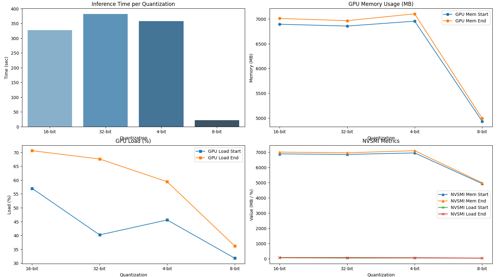
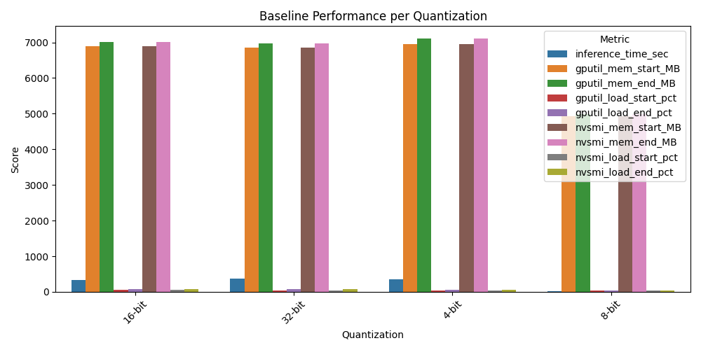
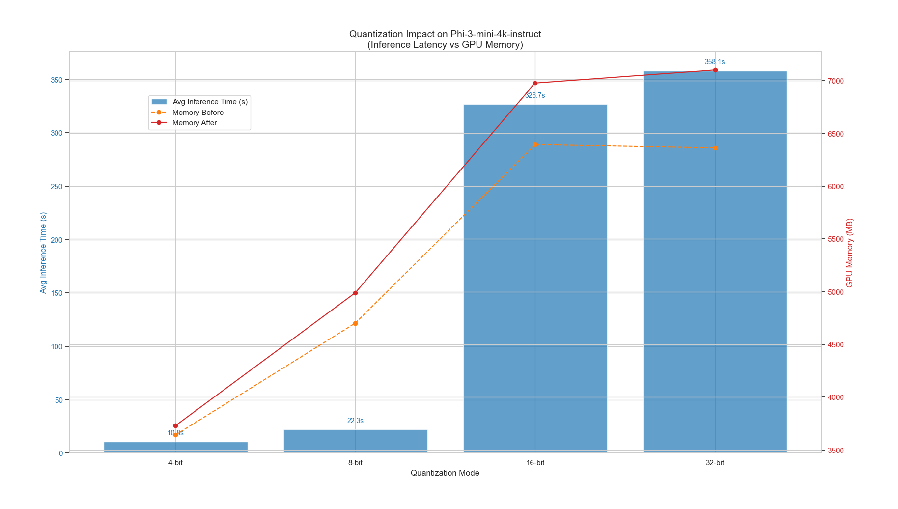

# 🧩 Phi-3 RAG Benchmark

This repository benchmarks **Microsoft’s Phi-3 Mini (4K Instruct)** model under different **quantization settings** to analyze inference speed, GPU memory utilization, and load behavior.
It provides a reproducible pipeline to measure model performance using Python, CUDA, and PyTorch-based inference workflows.

---

## 🚀 Project Overview

The benchmark aims to evaluate **Phi-3 Mini 4K Instruct** for **Retrieval-Augmented Generation (RAG)** and general inference workloads.
The tests cover multiple quantization formats including:

* 🟢 4-bit
* 🟡 8-bit
* 🔵 16-bit
* 🔴 32-bit

Each configuration was analyzed for:

* ⏱️ Inference Time
* 💾 GPU Memory (start/end)
* 🔋 GPU Load (start/end)
* 🧮 NVSMI Metrics (memory & load)

---

## 🖥️ System Specifications

| Component        | Specification                         |
| ---------------- | ------------------------------------- |
| **Device**       | Lenovo Legion Slim 7i                 |
| **Processor**    | Intel® Core™ i9-13900H                |
| **GPU**          | NVIDIA GeForce RTX 4060 (8 GB VRAM)   |
| **CUDA Version** | 12.1                                  |
| **OS**           | Windows 11 (PowerShell + VSCode)      |
| **Python Env**   | Conda (Python 3.10, `rag_server` environment) |

---

## 📂 Repository Structure

```
Phi-3-mini-4k-instruct/
│
├───results/
│   ├── Figure_1.png
│   ├── Figure_3.png
│   ├── phy3_inference_graph.png
│   └── analysis/
│       ├── phi3_baseline_combined.csv
│       └── phi3_baseline_summary.csv
│
├───scripts/
│   ├── Phi3_inference_demo.py
│   ├── phi3_server.py
│   ├── phi3_baseline.py
│   ├── analyze_phi3_baselines.py
│   └── graph.py
│
├── requirements.txt
├── setup_env.bat
└── .gitignore
```

---

## 📊 Results & Visualizations

Below are the benchmark visualizations generated from `results/analysis/phi3_baseline_summary.csv` and `phi3_baseline_combined.csv`.

### 🔹 Performance Metrics Visualization


### 🔹 Quantization Performance Comparison


### 🔹 Phi-3 Inference Comparison


---

## 🧪 How to Reproduce

### 1️⃣ Setup Environment

```bash
conda create -n rag_server python=3.10 -y
conda activate rag_server
pip install -r requirements.txt
```
### 2️⃣ Run Baseline Tests

```bash
python scripts/phi3_server.py
```

### 3️⃣ Run Baseline Tests

```bash
python scripts/phi3_baseline.py
```

### 4️⃣ Analyze Results

```bash
python scripts/analyze_phi3_baselines.py
```

### 5️⃣ Generate Graphs

```bash
python scripts/graph.py
```

All generated plots will be saved under `results/`.

---

## ⚙️ Technical Notes

* **Model tested:** Phi-3 Mini (4K Instruct)
* **Inference framework:** PyTorch + CUDA
* **Quantization:** handled using `bitsandbytes` and `torch.quantization`
* **Benchmark metrics collected with:**

  * `GPUtil` for memory/load tracking
  * `nvidia-smi` CLI for system-level metrics

---

## 📈 Observations

| Quantization | Inference Time (sec) | GPU Memory Start (MB) | GPU Memory End (MB) | GPU Load End (%) |
| ------------ | -------------------- | --------------------- | ------------------- | ---------------- |
| 4-bit        | 358.05               | 6953.8                | 7101.6              | 59.4             |
| 8-bit        | 22.27                | 4932.4                | 4990.0              | 36.2             |
| 16-bit       | 326.66               | 6891.6                | 7008.4              | 70.6             |
| 32-bit       | 381.39               | 6855.0                | 6964.0              | 67.6             |

🧩 **8-bit quantization demonstrated the best trade-off between inference speed and GPU load.**

---

## 📜 License

This project is licensed under the **MIT License** — feel free to use and modify with attribution.

---

## 🙌 Credits

Developed by **Vishnu Das P K**
GPU Benchmarking, Analysis, and Visualization for Phi-3 Mini 4K Instruct (RAG Pipeline Testing)
💡 Repository: `phi3-rag-benchmark`